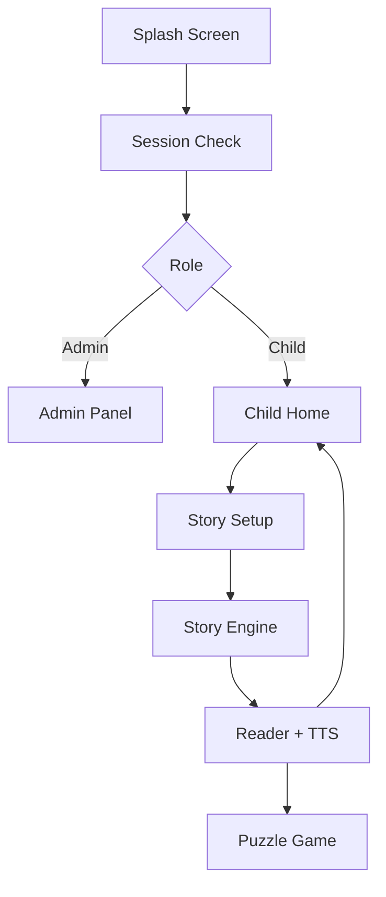

# 📖 Qisasi (قصصي)

**Qisasi** is an Offline-first interactive storytelling and learning platform for children aged 6–10 years.

It combines personalized story generation, synchronized Text-to-Speech (TTS), and educational puzzle games in a fully local and privacy-focused environment.

Unlike cloud-based platforms, Qisasi runs entirely offline using a lightweight rule-based inference engine, ensuring fast performance and complete data privacy.

---

## 🚀 Key Highlights

- 📚 Personalized story recommendation engine (Rule-based)
- ⚡ Fully Offline-first architecture
- 🔒 Local SQLite storage (no cloud dependency)
- 🗣️ Synchronized Text-to-Speech narration
- 🎮 Educational sliding puzzle game
- 👨‍👩‍👧 Parent monitoring dashboard
- 👨‍💼 Role-Based Access Control (RBAC)
- 🌍 Full Arabic RTL support
---


# 📸 Application Screens

The application's interfaces are organized into three visual collages located inside the **screen/** directory.

## 1️⃣ Onboarding & Parent Dashboard

This collage presents the application's onboarding experience, authentication screens, child registration, password-strength validation, and the parent dashboard for monitoring reading progress.


---

## 2️⃣ Story Creation, Reading & Puzzle Game

This section illustrates the complete storytelling workflow:

* Story customization wizard
* Character selection
* Animal selection
* Story location selection
* Mood selection
* Personalized story generation
* Reading interface
* Text-to-Speech synchronization
* Sliding Puzzle Game
* Confetti celebration after victory


---

## 3️⃣ Administrator Dashboard

This collage showcases the administrative management interface responsible for:

* User management
* Freeze / Reactivate child accounts
* Character management
* Animal management
* Mood management
* Location management
* Story management
* Role-Based Access Control (RBAC)


---

# 🧠 Weighted Rule-Based Inference Engine

The core intelligence of **Qisasi** is implemented through a lightweight **Weighted Rule-Based Inference Engine** (`StoryEngine`).

Instead of relying on cloud-based Artificial Intelligence or Machine Learning models, the application performs all recommendation logic locally. This design choice ensures:

* Complete offline functionality
* Deterministic and explainable recommendations
* Extremely fast execution
* Zero cloud dependency
* Maximum privacy for children

## ⚖️ Story Matching Weights

Each story attribute contributes a predefined weight to the overall matching score.

| Attribute        | Weight | 
| ---------------- | -----: | 
| Mood / Category  |  **5** | 
| Character        |  **3** |
| Location         |  **3** | 
| Animal Companion |  **2** | 

### Example Score

```text
Mood Match        +5
Character Match   +3
Location Match    +3
Animal Match      +2
---------------------
Total Score      =13
```

The story with the highest cumulative score is selected for presentation.

When multiple stories obtain the same score, the engine randomly selects one of them to avoid repetitive recommendations and improve the child's reading experience.

## Algorithm Workflow

1. Retrieve all customizable stories from SQLite.
2. Join related Characters and Animals.
3. Compare every child selection with each story.
4. Increment the cumulative score using predefined weights.
5. Track the highest score.
6. Collect all stories with the same highest score.
7. Randomly select one story if a tie occurs.
8. Return the selected story to the reading interface.

# 🗄️ Database Architecture

Qisasi relies on a fully local **SQLite** database designed around relational principles and foreign key constraints to ensure data consistency, maintainability, and offline reliability.

The database consists of **14 interconnected tables**, grouped into three functional modules.


---

# 🔄 Application Data Flow

The application follows a straightforward workflow beginning with authentication and ending with educational gameplay.


## 1. Authentication & RBAC Flow

When the application launches, the **Splash Screen** verifies whether a valid local session already exists.

* **Administrators** are redirected to the management dashboard.
* **Active children** are taken directly to the main application.
* **Inactive accounts** are prevented from accessing the system.

This separation ensures secure access control while maintaining a simple user experience.

---

## 2. Story Recommendation Flow

After completing the four-step customization wizard, the child selects:

* Character
* Animal
* Location
* Mood

These selections are passed to:

```text
StoryEngine.findBestStory(...)
```

The inference engine calculates a weighted score for every customizable story stored in SQLite and immediately returns the highest-ranked match.

If multiple stories receive the same score, one is selected randomly to reduce repetitive recommendations.

---

## 3. Reading Experience

Once a story has been selected, the application automatically:

* Displays the personalized story.
* Starts synchronized Text-to-Speech narration.
* Tracks reading duration.
* Allows the child to bookmark the story.
* Saves reading activity locally.

All information remains stored on the device without requiring an internet connection.

---
## 🎮 Educational Puzzle Game Flow

After reading, children can play an adaptive puzzle game with three difficulty levels:

- Easy (3×3): Ghost image help for guidance  
- Medium (4×4): Limited hints (3 previews)  
- Hard (5×5): No hints or visual support  

The game uses a drag-and-drop tray system with real-time validation. Correct placements lock the piece with positive feedback, while incorrect moves trigger shake animation and haptic feedback.

A timer tracks completion time, and upon finishing, a confetti animation is displayed with options to replay or return home.

---

## 5. Local Time Handling

SQLite's built-in `CURRENT_TIMESTAMP` stores timestamps in UTC.

To ensure parental reports accurately reflect the device's local time, Qisasi records activity timestamps using:

```dart
DateTime.now().toIso8601String()
```

This guarantees that reading analytics correspond to the child's actual local time rather than UTC.

# 🎨 Technology Stack

Qisasi is built using modern cross-platform technologies that emphasize performance, maintainability, and complete offline functionality.

| Technology                                         | Purpose                                                        |
| -------------------------------------------------- | -------------------------------------------------------------- |
| **Flutter**                                        | Cross-platform application development for Android and Windows |
| **Dart**                                           | Core programming language                                      |
| **SQLite**                                         | Local relational database                                      |
| **sqflite**                                        | SQLite integration for Flutter                                 |
| **flutter_tts**                                    | Text-to-Speech narration                                       |
| **shared_preferences**                             | Local session persistence                                      |
| **Material Design**                                | Responsive and accessible user interface                       |

---

# 🚀 Getting Started

## Prerequisites

Before running the project, ensure that you have installed:

* Flutter SDK
* Dart SDK
* Android Studio or Visual Studio Code
* Git

---

## Installation

```bash
git clone https://github.com/your-username/qisasi.git

cd qisasi

flutter pub get

flutter run
```


---

# 🔮 Future Improvements

The current implementation provides a complete offline storytelling experience. Future enhancements may include:

* 🌐 Cloud synchronization across multiple devices
* 🤖 AI-generated dynamic stories using Large Language Models (LLMs)
* 🎙️ Voice-based story customization
* 🏆 Achievement and reward system
* 📈 Advanced learning analytics
* 📚 Expanded multilingual story library
* 👥 Multi-child family profiles
* ☁️ Optional encrypted cloud backup

---


