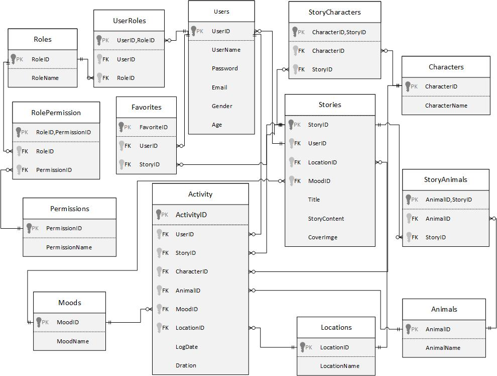
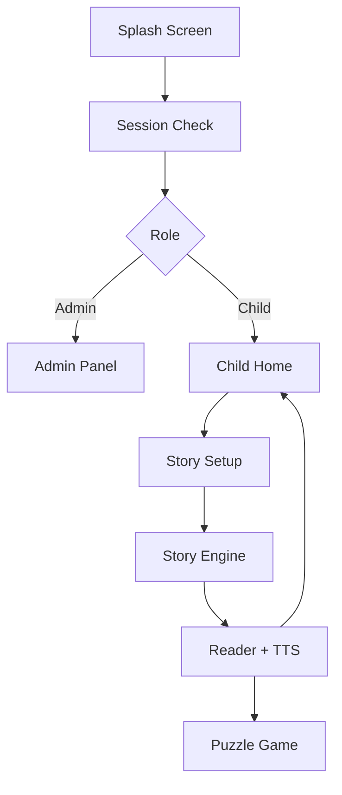

# Qisasi-Interactive-Storytelling-App

**Qisasi** is an offline-first interactive storytelling and learning platform for children aged 6–10.

It combines personalized story generation, synchronized text-to-speech (TTS), and educational puzzle games in a fully local, privacy-focused environment. Unlike cloud-based platforms, Qisasi runs entirely offline using a lightweight rule-based inference engine, ensuring fast performance and complete data privacy.

---

## Table of Contents

- [Key Highlights](#key-highlights)
- [Application Screens](#application-screens)
- [Weighted Rule-Based Inference Engine](#weighted-rule-based-inference-engine)
- [Database Architecture](#database-architecture)
- [Application Data Flow](#application-data-flow)
- [Technology Stack](#technology-stack)
- [Team & Contributions](#-team--contributions)
- [Getting Started](#getting-started)
- [Future Improvements](#future-improvements)
- [License](#license)

---

## Key Highlights

- Personalized story recommendation engine (rule-based)
- Fully offline-first architecture
- Local SQLite storage — no cloud dependency
- Synchronized text-to-speech narration
- Educational sliding puzzle game
- Parent monitoring dashboard
- Role-based access control (RBAC)
- Full Arabic RTL support

---

## Application Screens


### 1. Onboarding & Parent Dashboard

Covers the onboarding experience, authentication screens, child registration, password-strength validation, and the parent dashboard for monitoring reading progress.


### 2. Story Creation, Reading & Puzzle Game

Illustrates the complete storytelling workflow:

- Story customization wizard
- Character, animal, location, and mood selection
- Personalized story generation
- Reading interface with TTS synchronization
- Sliding puzzle game with confetti celebration on completion


### 3. Administrator Dashboard

Covers the administrative management interface, responsible for:

- User management (freeze / reactivate child accounts)
- Character, animal, mood, and location management
- Story management
- Role-based access control (RBAC)


---

## Weighted Rule-Based Inference Engine

The core intelligence of Qisasi is implemented through a lightweight **weighted rule-based inference engine** (`StoryEngine`). Instead of relying on cloud-based AI or ML models, the application performs all recommendation logic locally, which provides:

- Complete offline functionality
- Deterministic, explainable recommendations
- Fast execution with no cloud dependency

### Matching Weights

Each story attribute contributes a predefined weight to the overall matching score:

| Attribute         | Weight |
| ----------------- | -----: |
| Mood / Category    |    5   |
| Character          |    3   |
| Location           |    3   |
| Animal Companion   |    2   |

**Example score:**

```text
Mood Match        +5
Character Match   +3
Location Match    +3
Animal Match      +2
---------------------
Total Score       =13
```

The story with the highest cumulative score is selected. When multiple stories tie for the highest score, the engine randomly selects one to avoid repetitive recommendations.

### Algorithm Workflow

1. Retrieve all customizable stories from SQLite.
2. Join related characters and animals.
3. Compare each child selection against every story.
4. Increment the cumulative score using predefined weights.
5. Track the highest score and collect all stories that match it.
6. Randomly select one story if a tie occurs.
7. Return the selected story to the reading interface.

---

## Database Architecture

Qisasi relies on a fully local SQLite database designed around relational principles and foreign key constraints, ensuring data consistency, maintainability, and offline reliability. The database consists of 14 interconnected tables, grouped into three functional modules.



---

## Application Data Flow

The application follows a workflow that begins with authentication and ends with educational gameplay.



### 1. Authentication & RBAC Flow

On launch, the splash screen verifies whether a valid local session already exists:

- **Administrators** are redirected to the management dashboard.
- **Active children** are taken directly to the main application.
- **Inactive accounts** are prevented from accessing the system.

### 2. Story Recommendation Flow

After completing the four-step customization wizard (character, animal, location, mood), the selections are passed to `StoryEngine.findBestStory(...)`. The engine calculates a weighted score for every customizable story in SQLite and returns the highest-ranked match, selecting randomly among ties.

### 3. Reading Experience

Once a story is selected, the application:

- Displays the personalized story
- Starts synchronized text-to-speech narration
- Tracks reading duration and allows bookmarking
- Saves reading activity locally, with no internet connection required

### 4. Educational Puzzle Game Flow

After reading, children can play an adaptive puzzle game with three difficulty levels:

- **Easy (3×3):** ghost-image guidance
- **Medium (4×4):** limited hints (3 previews)
- **Hard (5×5):** no hints or visual support

The game uses a drag-and-drop tray with real-time validation. Correct placements lock the piece with positive feedback; incorrect moves trigger a shake animation and haptic feedback. A timer tracks completion time, and a confetti animation plays on completion, with options to replay or return home.

### 5. Local Time Handling

SQLite's built-in `CURRENT_TIMESTAMP` stores timestamps in UTC. To ensure parental reports reflect the device's local time, Qisasi records activity timestamps using:

```dart
DateTime.now().toIso8601String()
```

This ensures reading analytics correspond to the child's actual local time rather than UTC.

---

## Technology Stack

| Technology              | Purpose                                                          |
| ------------------------ | ----------------------------------------------------------------- |
| Flutter                  | Cross-platform application development for Android and Windows    |
| Dart                     | Core programming language                                         |
| SQLite                   | Local relational database                                         |
| sqflite                  | SQLite integration for Flutter                                    |
| flutter_tts              | Text-to-speech narration                                          |
| shared_preferences       | Local session persistence                                         |
| Material Design          | Responsive and accessible user interface                          |

---
## 👥 Team & Contributions

This project was developed as a collaborative graduation project. Below is the breakdown of my core technical contributions to the platform:

### 🛠️ My Contributions 
* **Database Design & Architecture:**  
  Designed the complete local relational database schema (ERD) from scratch. Defined entities, relationships, and constraints across the application's 14 interconnected tables, providing the foundation for the offline-first data architecture.

* **Weighted Rule-Based Inference Engine:**  
  Designed and implemented the core `StoryEngine` algorithm in Dart. Developed a deterministic recommendation pipeline that calculates weighted matching scores based on user-selected attributes (Mood, Character, Location, and Animal), with tie-breaking logic for equivalent matches.

* **Story & Asset Management Pipeline:**  
  Developed the logic responsible for retrieving, processing, and presenting localized Arabic stories with their associated visual assets entirely offline.

* **Core UI & Feature Implementation:**  
  Designed and implemented key user journeys and their state management logic, including:
  * **Story Reading View:** Built the main reading interface and integrated text presentation with text-to-speech (TTS) synchronization.
  * **Home Screen:** Developed the main navigation dashboard for children.
  * **Story Customization Wizard:** Created the interactive multi-step story configuration flow.
  * **Favorites & Bookmarks System:** Implemented local persistence for saved stories.
  * **Ready-Made Stories Library:** Developed the browsing experience with dynamic local data binding.
  ---

## Getting Started

### Prerequisites

- Flutter SDK
- Dart SDK
- Android Studio or Visual Studio Code
- Git

### Installation

```bash
git clone https://github.com/<RinadSalem>/qisasi.git
cd qisasi
flutter pub get
flutter run
```

> Replace `<your-username>` with the actual GitHub username or organization hosting this repository.

---

## Future Improvements

- Cloud synchronization across multiple devices
- AI-generated dynamic stories using large language models (LLMs)
- Voice-based story customization
- Achievement and reward system
- Advanced learning analytics
- Expanded multilingual story library
- Multi-child family profiles
- Optional encrypted cloud backup


## License

This project is licensed under the [MIT License](LICENSE) 
